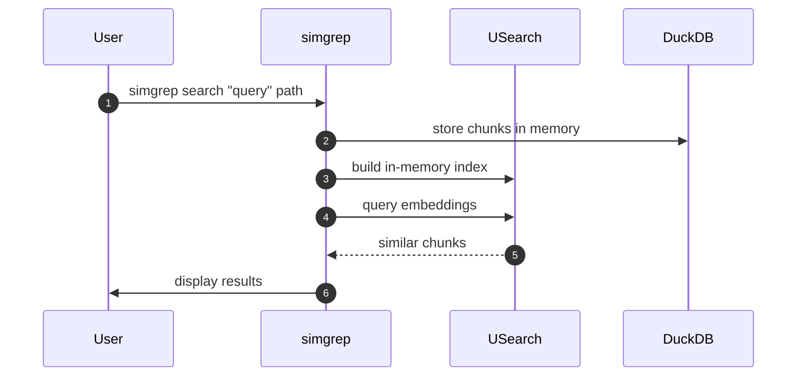
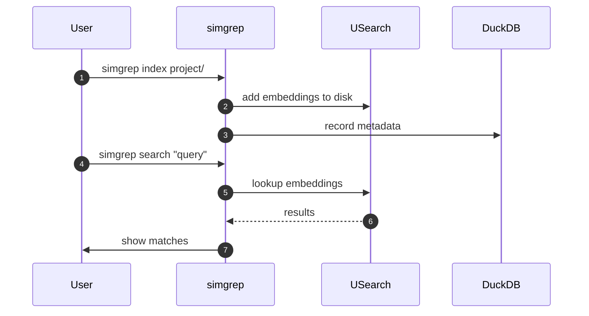
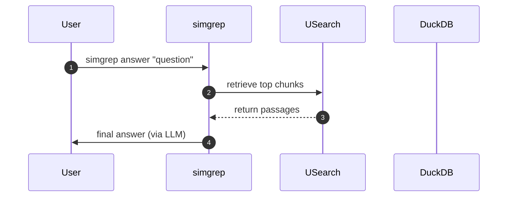

# Use Cases

`simgrep` supports several workflows for searching and answering questions over your local files.

## Ephemeral Search

For one-off queries, `simgrep` creates a temporary index in memory, searches it, then discards it.

## Persistent Indexing & Search

Projects can be indexed once and searched many times. Index data is saved on disk.

## RAG-Based Answering

`simgrep` can retrieve relevant chunks and feed them to a language model to answer questions.

