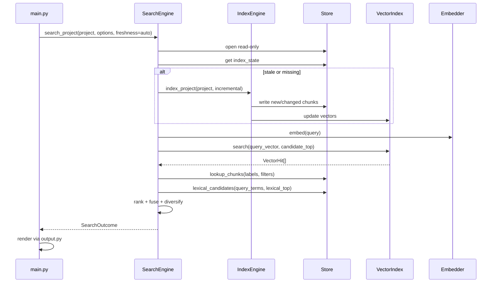
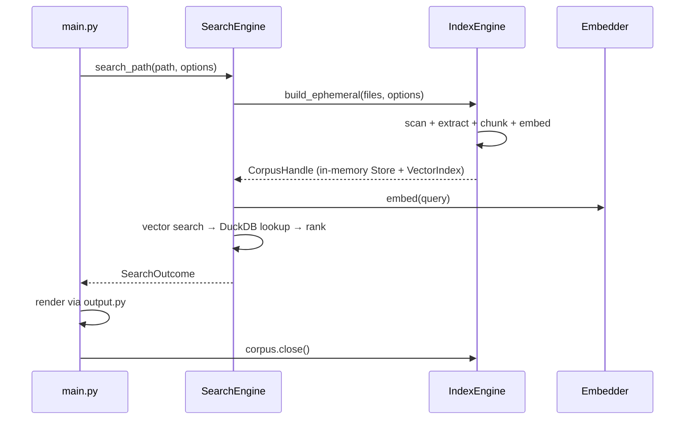

# Use Cases

## Initialize Local Project

```
simgrep init
```

Creates `.simgrep/project.toml` in the current directory. Indexed paths default to `["."]` (the project root).

## Run from a Different Repository

When `simgrep` is not installed globally and you are developing it locally, run it via `uv` while targeting this repository as the project environment.

```bash
uv run --project /path/to/simgrep simgrep init /path/to/target-repo
uv run --project /path/to/simgrep simgrep -C /path/to/target-repo index
uv run --project /path/to/simgrep simgrep -C /path/to/target-repo search "invoice status transitions" --top 5
```

`-C` (`--project-root`) runs the command as if it was started in that directory. This lets you manage and query a repo without changing your shell location.

## Build the Index

```
simgrep index
```

First run downloads the embedding model and indexes all discovered files. Subsequent runs are incremental — only new and modified files are processed.

**Rebuild from scratch:**

```
simgrep index --rebuild
```

**Preview without writing anything:**

```
simgrep index --dry-run
```

Reports the file plan (new, changed, unchanged, deleted, ignored, too_large, unreadable) without mutating the store.

## Persistent Search

```
simgrep index
simgrep search "rollback payment"
```

Loads `.simgrep/metadata.duckdb` and `.simgrep/vectors.usearch`. By default uses `freshness=auto`, which re-indexes stale files before searching.

**Control freshness explicitly:**

```
simgrep search "rollback payment" --freshness check   # fail if stale
simgrep search "rollback payment" --freshness skip    # trust current index
```

## Ephemeral Search

```
simgrep search "rollback payment" ./src --ephemeral
```

Builds an in-memory index for `./src` and discards it after rendering. No project needed.

**Auto-selection:** supplying a `PATH` that is not covered by an active project runs ephemeral automatically without `--ephemeral`.

## Path Management

```
simgrep project add-path docs
simgrep project remove-path docs
simgrep project info
```

Paths are stored project-root-relative when possible. Resolved to absolute paths at load time.

## Project Status

```
simgrep status
```

Reports file counts, chunk counts, index state, and last indexed timestamp for the active project.

## Interactive REPL

```
simgrep repl
```

Opens a persistent session that reuses the loaded model and index across queries. Useful for iterative exploration.


## Agent Integration (MCP)

Expose simgrep to any MCP client — Claude Code, Cursor, Zed, or your own agent:

```bash
claude mcp add simgrep -- simgrep mcp
```

The agent gets nine tools: `search`, `similar`, `clusters`, `diff`, `expand`, `pack`, and `debt`
(same JSON payloads as their `simgrep ... --format json` CLI counterparts), plus `status` and `index`.
The server runs over stdio with no network
surface, needs no extra dependencies, and only loads the embedding model when the agent first
searches or indexes.

Example raw exchange (newline-delimited JSON-RPC 2.0):

```
{"jsonrpc":"2.0","id":1,"method":"initialize","params":{"protocolVersion":"2025-06-18"}}
{"jsonrpc":"2.0","id":2,"method":"tools/call","params":{"name":"search","arguments":{"query":"rollback payment"}}}
```

## Machine Output

```
simgrep search "tax invoice" --format json
simgrep search "tax invoice" --format jsonl
simgrep search "tax invoice" --format paths
simgrep search "tax invoice" --format count
simgrep search "tax invoice" --format grep
```

Machine formats write only payload to stdout. Warnings go to stderr.

## Filters and Boosts

```
simgrep search "retry logic" --include "*.py" --exclude "tests/**"
simgrep search "retry logic" --pattern "*.py"
simgrep search "retry logic" --top 5 --min-score 0.6
simgrep search "retry logic" --file-filter payments
simgrep search "retry logic" --keyword timeout
```

## Diversity

```
simgrep search "config loading" --diversity file      # one result per file
simgrep search "config loading" --diversity package   # two results per directory
simgrep search "config loading" --diversity none      # no deduplication
```

## Query-by-Example with Contrastive Exclusion

Find every variant of a known snippet — and subtract what you don't want:

```
# all near-clones of an error handler, in the current project
simgrep similar @./src/errors/http.py

# like this handler, but unlike the retry-heavy pattern (lambda 0.7)
simgrep similar ./src/errors/http.py:1-40 --unlike @./src/retry/pattern.py --unlike-weight 0.7

# anchor from stdin, machine-readable output for scripts
cat snippet.go | simgrep similar - ./src --format jsonl
```

Scores combine both anchors as `s_like − λ·s_unlike`; chunks from the anchor's own
file span are excluded unless `--include-self` is passed.

## Boolean Semantic Queries

Combine topics with boolean logic instead of one blended query. Each leaf is searched
semantically on its own, then scores fuse with fuzzy `AND`/`OR`/`NOT`:

```
# auth or login material, excluding the oauth machinery
simgrep search --expr "(auth OR login) AND NOT oauth"

# quoted phrases act as single leaves; adjacent atoms combine with implicit AND
simgrep search --expr '"connection pool" AND retry'

# machine-readable hits for scripts
simgrep search --expr "cache AND NOT memoize" --format jsonl
```

Expression search runs against the active project from the cwd — run `simgrep init`
and `simgrep index` first (or use an already-indexed repo).

Operators are UPPERCASE (`and`/`or`/`not` are ordinary words); parens group. `--expr`
is pure semantic scoring: `--hybrid` is ignored and explicit lexical flags are rejected;
a plain `query` and `--expr` are mutually exclusive.

## Find Semantic Duplicates

Sweep the whole index for copy-paste clones and drifted duplicates — no known anchor required:

```
# cluster the active project (persistent index)
simgrep clusters

# one-off ephemeral scan of a directory, stricter threshold
simgrep clusters ./vendor --threshold 0.9 --min-size 3

# file list for a duplicate-detection CI gate
simgrep clusters --format paths
```

Clusters are ranked by duplicated line count; each reports its worst pairwise similarity
(`score`), total `duplicated_lines`, and members as `path:line_start-line_end`.

## Compare Two Trees Semantically

Compare two directory trees by meaning — a code review between releases, a vendored-copy
audit, or a pre-merge sanity check. Chunks are matched one-to-one by similarity, so files
that merely moved or were renamed with unchanged content are invisible; only real changes
are reported:

```
simgrep diff ./release-1.2 ./release-1.3

# stricter matching, only list the top 10 added/removed chunks
simgrep diff ./old ./new --threshold 0.9 --top 10

# machine-readable summary: "12 matched, 2 added, 1 removed"
simgrep diff ./old ./new --format count
```

Example: copy a tree, rename `invoice.py` to `invoice_v2.py` unchanged, reword
`session.py`, delete `markdown.py`, and add `promo.py`. The diff reports exactly the
reword, deletion, and addition — the renamed file shows up in the per-file rollup as two
rows (`tree_a/invoice.py` and `tree_b/invoice_v2.py`), each with `0 added, 0 removed,
1 matched`, since matched pairs attribute to both side paths. `--format json|jsonl|count`
emit stdout-only payloads for scripts and CI gates.


## Audit tech debt before a milestone

Planning the next milestone starts with an honest map of what is already broken. `simgrep debt`
scans a corpus for debt markers (`TODO`, `FIXME`, `XXX`, `HACK`, `WORKAROUND`), clusters the
marker chunks semantically into **themes** — so "the retry logic debt" shows up as one cluster
spanning several files, not five unrelated grep lines — labels each theme with its dominant
tokens, and attaches the last-commit age of every file involved:

```
simgrep debt .                         # themes, ages, scattered singletons
simgrep debt ./src --top 10 --format json | jq

# CI-style gate: fail when any dated theme is older than 90 days
simgrep debt . --max-age 90 || echo "stale debt themes exceed the milestone gate"
```

Themes rank largest-oldest first, so the top of the report is exactly where the next refactoring
budget should go. Undated (non-git) files never fail the gate, and a corpus without markers
exits `0` — the gate only breaks when tracked debt actually outlives your deadline.

## Read the Whole Function, Not a Window

A search hit is a chunk window — on a big function it cuts off mid-body, and an agent
that patches what it cannot see breaks the code. Expand the hit to its enclosing
semantic unit first:

```
simgrep search "gateway timeout rollback" ./payment-service --whole-unit --format json
# every hit now spans its whole function: line_start..line_end cover the unit,
# text carries the full body (capped by --max-chars with a trailing ...)
```

`--whole-unit` is a result transform: ranking, order, and scores are untouched; each
hit's span and text grow to the enclosing unit. If a file was deleted after indexing,
the hit degrades back to the stale chunk (`stale_offsets: true`) instead of failing.

For a single interesting hit, expand it directly by line — lexical scope analysis, no
index required, so agents can jump from `search` to `expand` without re-indexing:

```
simgrep expand src/payment.py 42 --format rich
# src/payment.py:31-58 (dedent, 28 lines)
#    31  def charge_order(order_id: str, amount_cents: int) -> bool:
#    ...

simgrep expand src/payment.py 42 --format json | jq .end_line
simgrep expand src/ledger.c 7            # brace family for C/Go/JS/TS/Rust/...
simgrep expand notes.md 3                # paragraph family: blank-line-delimited block
```

Families are chosen by extension: dedent (Python/YAML), brace (C, Go, Java, JS/TS,
Rust, ...), paragraph (everything else). `--language` overrides the detection. Exit
codes: `0` ok · `1` unreadable file · `2` usage error (line out of range prints
`file has N lines`).

## Assemble a Budgeted Context Block for an Agent

An agent prompt has a token budget and wants distinct, relevant context — not eight
near-identical windows of the same function. `pack` runs your queries, unions the hits,
and greedily selects a deduplicated, budget-fitting block with citations:

```
simgrep pack "gateway timeout" "refund flow" ./payment-service --budget 3000 --format json
# pinned payload: queries, budget_tokens, used_tokens, pool_size, dropped, selections[]
# each selection: path, line_start, line_end, score, tokens, truncated, text
```

Selections come back in greedy pick order. Near-duplicates are demoted (MMR-style:
`--lam` weights relevance vs diversity), candidates that no longer fit are dropped
(`dropped` reports the count), and if every candidate is oversized the single best one
is truncated to the budget — the budget is never exceeded. Paste the markdown format
straight into an issue or PR; feed the JSON to your agent harness.

Exit codes: `0` ok · `1` no candidates · `2` usage error (bounds violations, conflicting
persistence flags).

## Rerank grep candidates semantically

`grep` finds files that *mention* the words; it can't rank how well each file actually
*answers* the question. Use `simgrep rerank` as the second stage of a grep pipeline: feed
it the candidate list, and a local cross-encoder reads every (query, chunk) pair pointwise —
query and document together — then reports each file's best chunk ranked by true fit:

```
grep -rl "except Exception" src/ | simgrep rerank "swallowing errors silently" --files-from -
simgrep rerank "retry with backoff" src/net.py src/worker.py --format jsonl
```

No index, no store, no embedder — the candidates come entirely from you, which makes this the
bridge between any external tool (grep, ripgrep, `git grep`, a code-review diff) and semantic
judgment. The same cross encoder can polish a normal search: `simgrep search Q ./src --rerank`
re-scores only the top-R hybrid hits (`--rerank-top`), so latency stays flat while precision on
the head of the list improves. Output formats and JSON shapes are unchanged; on reranked hits the
`score` field carries the cross score.

## Model Cache

```
simgrep models status
simgrep models cache ibm-granite/granite-embedding-30m-english
```

Pre-download models before going offline.

## Config

```
simgrep config list
simgrep config get model
simgrep config set model ibm-granite/granite-embedding-30m-english
```

Reads and writes `~/.config/simgrep/config.toml`.

## Diagnostics

```
simgrep doctor
```

Prints the loaded global config status, the configured model, and the active project root.

---

## Sequence: Persistent Search (freshness=auto)


```mermaid
sequenceDiagram
    participant CLI as main.py
    participant SE as SearchEngine
    participant IE as IndexEngine
    participant ST as Store
    participant VI as VectorIndex
    participant EM as Embedder

    CLI->>SE: search_project(project, options, freshness=auto)
    SE->>ST: open read-only
    SE->>ST: get index_state
    alt stale or missing
        SE->>IE: index_project(project, incremental)
        IE->>ST: write new/changed chunks
        IE->>VI: update vectors
    end
    SE->>EM: embed(query)
    SE->>VI: search(query_vector, candidate_top)
    VI-->>SE: VectorHit[]
    SE->>ST: lookup_chunks(labels, filters)
    SE->>ST: lexical_candidates(query_terms, lexical_top)
    SE->>SE: rank + fuse + diversify
    SE-->>CLI: SearchOutcome
    CLI->>CLI: render via output.py
```

## Sequence: Ephemeral Search


```mermaid
sequenceDiagram
    participant CLI as main.py
    participant SE as SearchEngine
    participant IE as IndexEngine
    participant EM as Embedder

    CLI->>SE: search_path(path, options)
    SE->>IE: build_ephemeral(files, options)
    IE->>IE: scan + extract + chunk + embed
    IE-->>SE: CorpusHandle (in-memory Store + VectorIndex)
    SE->>EM: embed(query)
    SE->>SE: vector search → DuckDB lookup → rank
    SE-->>CLI: SearchOutcome
    CLI->>CLI: render via output.py
    CLI->>IE: corpus.close()
```
